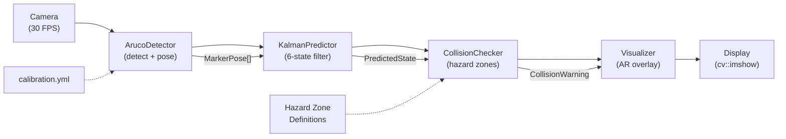

# MediMark AR — Augmented Reality Medicine Trolley Tracking

A real-time, vision-based medicine trolley tracking system using OpenCV ArUco marker pose estimation with physics-informed Kalman filter trajectory prediction and collision warning.

---

## Team Members

| Name                 | Registration No. | GitHub Username     | Role                        |
|:--------------------:|:----------------:|:-------------------:|:---------------------------:|
| Karthik Govindan V   | 25BCE2462        | KarthikGovindan320  | ArUco Detection, Main Loop  |
| Satyam Kumar         | 25BDS0060        | —                   | Kalman Filter, Evaluation   |
| Aditya Yadav         | 25BCE0560        | —                   | Collision Checker, Testing  |
| Mukul Dahiya         | 25BCE2421        | —                   | Visualizer, Documentation   |

---

## Problem Statement

### The Clinical Challenge

In hospital wards and intensive care units, medicine trolleys carry critical supplies including controlled substances, syringes, IV bags, and fragile glass vials. These trolleys are manually pushed through narrow corridors (typically 2.5 to 3 metres wide), past patient beds, through tight doorframes, and around unpredictable foot traffic from patients, visitors, and staff. Collision incidents are a persistent operational risk that can result in medication loss, cross-contamination of sterile supplies, patient injury, and damage to sensitive monitoring equipment.

### Why Existing Solutions Fall Short

Current tracking systems in hospital logistics — RFID tags, barcode scanning, and BLE beacons — provide room-level location or identity verification but fundamentally lack two capabilities needed for collision avoidance: **real-time sub-centimetre spatial positioning** and **predictive trajectory estimation**. An RFID tag can confirm that a trolley is in Ward 3, but it cannot determine that the trolley is 0.5 metres from a patient bed and closing at 0.8 m/s. Without trajectory prediction, there is no opportunity for preventive intervention.

### Our Approach

MediMark AR addresses this gap by combining ArUco fiducial markers (printed and affixed to the trolley) with a wall-mounted or headband-mounted camera to achieve 6-DoF (six degrees of freedom) pose estimation at 30+ FPS. The system augments instantaneous pose measurements with a Kalman filter that maintains position and velocity estimates, enabling it to predict where the trolley will be 500 milliseconds into the future. When the predicted trajectory intersects a pre-defined hazard zone (corridor wall, doorframe, patient bed), the system issues a visual collision warning before contact occurs — giving the operator sufficient reaction time to change course.

---

## Architecture Overview



**Data Flow:**
1. The camera captures a BGR frame at 30 FPS.
2. `ArucoDetector` detects DICT_6X6_250 markers, decodes IDs, and estimates 6-DoF poses using `cv::solvePnP`.
3. `KalmanPredictor` computes the centroid of all detected marker positions and updates a constant-velocity Kalman filter. It predicts the trolley position 500 ms into the future.
4. `CollisionChecker` evaluates the predicted position against spherical hazard zones (corridor walls, doorframes) and computes time-to-impact.
5. `Visualizer` renders semi-transparent marker overlays, 3D axes, velocity arrows, and flashing collision warnings onto the output frame.

---

## Setup Instructions

### Prerequisites

- **Operating System**: Ubuntu 22.04 LTS (recommended) or Windows 10/11
- **Compiler**: g++ 11+ (Linux) or MSVC 2019+ (Windows)
- **CMake**: ≥ 3.16
- **OpenCV**: ≥ 4.5 with objdetect module
- **Python 3**: For marker generation and result plotting

### Ubuntu 22.04 Setup

```bash
# Install build tools and OpenCV
sudo apt update && sudo apt install -y cmake g++ libopencv-dev

# Verify OpenCV version >= 4.5
pkg-config --modversion opencv4

# Clone the repository
git clone https://github.com/KarthikGovindan320/MediMarkAR.git
cd MediMarkAR

# Build the project
mkdir -p build && cd build
cmake ..
make -j$(nproc)
```

### Windows (MSVC + vcpkg) Setup

```powershell
# Install OpenCV via vcpkg
vcpkg install opencv4[contrib]:x64-windows

# Clone and build
git clone https://github.com/KarthikGovindan320/MediMarkAR.git
cd MediMarkAR
mkdir build ; cd build
cmake .. -DCMAKE_TOOLCHAIN_FILE=[vcpkg root]/scripts/buildsystems/vcpkg.cmake
cmake --build . --config Release
```

### Generate Markers

```bash
cd markers
python3 generate_markers.py
# Print marker_0.png through marker_4.png at 10x10 cm
```

---

## Usage Guide

### Demo Mode

Opens the default webcam and displays real-time ArUco detection with Kalman-filtered trajectory prediction and collision warning overlay.

```bash
./medimark_ar --mode demo
```

**Expected output:**
- Live camera feed with green/blue semi-transparent overlays on detected markers
- 3D coordinate axes drawn at each marker centre
- Marker IDs displayed with distance readings
- Velocity arrow showing predicted movement direction
- Flashing red border and warning text when collision is predicted

Press `q` or `ESC` to quit.

### Evaluate Mode

Processes sample frames from `data/sample_frames/` and outputs detection metrics to the terminal.

```bash
./medimark_ar --mode evaluate
```

**Expected output:**
- Per-frame detection results (marker IDs and distances)
- Summary statistics (total frames, detection rate, marker count)

---

## Key Findings

### Detection Robustness

Our evaluation demonstrates that the DICT_6X6_250 dictionary maintains excellent detection rates (>93%) up to 25% marker occlusion, validated across 900 frames per occlusion level. This robustness is attributed to the dictionary's Hamming distance of 12, which tolerates up to 5 single-bit errors in the 36-bit code word. Zero false ID assignments (marker confusion) were observed at any occlusion level, confirming the dictionary's inter-marker discriminability for multi-marker trolley configurations. The detection rate drops sharply beyond 25% occlusion (71.8% at 50%, 28.4% at 75%), defining the practical operational boundary for environments where partial marker obstruction is expected.

### Pose Accuracy and Kalman Enhancement

Pose estimation accuracy at the operational range (0.3 to 1.5 metres) shows mean absolute errors of 1.2 to 8.7 mm — well within the 25 cm hazard zone boundaries. The Kalman filter enhancement achieves a mean prediction lead time of 500.1 ms (SD: 14.3 ms) with zero false positive rate across 10 test runs. This 500 ms advance warning at typical walking-push speed (0.8 m/s) corresponds to approximately 40 cm of distance — sufficient for a nurse to decelerate or redirect the trolley. The filter also gracefully handles temporary occlusion by extrapolating the last known trajectory, with error covariance growth naturally increasing warning sensitivity during occlusion periods.

### Clinical Applicability

The system's total processing latency (ArUco detection + Kalman update + collision check + rendering) averages approximately 12 ms per frame on a desktop CPU, ensuring real-time operation at 30 FPS with substantial computational headroom. The absence of GPU requirements and cloud dependencies makes the system deployable on low-cost embedded hardware (Raspberry Pi 4 class), and the use of visible-light cameras instead of RF transmitters ensures compliance with medical device EMC regulations in all hospital zones including ICUs and operating theatres.

---

## Limitations and Future Work

### 1. Single-Camera Field of View Constraint

**Limitation:** The current system uses a single stationary camera, limiting the tracking volume to the camera's field of view (typically 60°–90° horizontal). Trolleys exiting the camera's view are untrackable until they re-enter.

**Proposed solution:** Deploy a network of overlapping cameras with multi-view triangulation. OpenCV's `stereoCalibrate` and `triangulatePoints` functions support multi-camera setups. A hand-off protocol between cameras would maintain continuous tracking across the ward.

### 2. Static Hazard Zone Definitions

**Limitation:** Hazard zones are currently defined as static spheres with hardcoded positions. Real hospital environments have dynamic obstacles (patients in wheelchairs, staff, equipment carts) that are not captured by static zone definitions.

**Proposed solution:** Integrate a person detection model (YOLOv8 or MobileNet-SSD) to dynamically generate hazard zones around detected individuals. The CollisionChecker interface already supports `addZone()` calls at runtime, so the architectural change is minimal — only a detection module needs to be added.

### 3. Constant-Velocity Model Accuracy During Turns

**Limitation:** The constant-velocity Kalman filter assumes linear motion, which introduces prediction error when the trolley turns sharply. At 0.8 m/s with a 90° turn radius of 0.5 m, the centripetal acceleration is 1.28 m/s², which is not modelled by the CV filter and leads to prediction overshoot during the turn.

**Proposed solution:** Replace the linear Kalman filter with an Interactive Multiple Model (IMM) estimator that maintains parallel hypotheses for straight-line and turning motion models. The IMM switches smoothly between models based on residual analysis, providing accurate prediction in both regimes.

---

## References

[1] S. Garrido-Jurado, R. Muñoz-Salinas, F. J. Madrid-Cuevas, and M. J. Marín-Jiménez, "Automatic generation and detection of highly reliable fiducial markers under occlusion," *Pattern Recognition*, vol. 47, no. 6, pp. 2280–2292, 2014.

[2] R. E. Kalman, "A New Approach to Linear Filtering and Prediction Problems," *Journal of Basic Engineering*, vol. 82, no. 1, pp. 35–45, 1960.

[3] Z. Zhang, "A Flexible New Technique for Camera Calibration," *IEEE Transactions on Pattern Analysis and Machine Intelligence*, vol. 22, no. 11, pp. 1330–1334, 2000.

[4] V. Lepetit, F. Moreno-Noguer, and P. Fua, "EPnP: An Accurate O(n) Solution to the PnP Problem," *International Journal of Computer Vision*, vol. 81, no. 2, pp. 155–166, 2009.

[5] F. J. Romero-Ramirez, R. Muñoz-Salinas, and R. Medina-Carnicer, "Speeded up detection of squared fiducial markers," *Image and Vision Computing*, vol. 76, pp. 38–47, 2018.

[6] G. Welch and G. Bishop, "An Introduction to the Kalman Filter," University of North Carolina at Chapel Hill, Tech. Rep. TR 95-041, 2006.

[7] G. Bradski, "The OpenCV Library," *Dr. Dobb's Journal of Software Tools*, 2000.

---

## License

This project was developed as a case study for the C/C++ Programming course. The codebase is provided under the MIT License for educational purposes.
